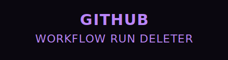

# GitHub Workflow Run Deleter

[](https://github.com/SANDRO00O/Workflow-Run-Deleter)
[](https://opensource.org/licenses/MIT)
[](https://github.com/SANDRO00O/Workflow-Run-Deleter/stargazers)



A secure and straightforward web tool for managing and deleting **GitHub Actions** workflow run history from your repositories. Easily clean up accumulated run histories, especially in high-activity repositories.


### [**Live Demo**](https://sandro00o.github.io/Workflow-Run-Deleter)

---

## 🎯 About The Project

Over time, GitHub Actions workflow runs can pile up, creating visual clutter and making it difficult to find specific runs. This tool was built to solve that problem by providing a simple interface to fetch all workflow runs for a given repository, filter them, and delete them individually or in bulk.

**This tool is fully client-side. Your credentials are never stored or sent to any server.**

## 🚀 Key Features

-   **Simple Interface:** Just enter the repository owner, name, and a Personal Access Token to get started.
-   **Comprehensive Fetching:** Fetches all workflow runs from the specified repository, handling pagination automatically.
-   **Advanced Filtering:** Filter runs by their status (`Success`, `Failure`, `Cancelled`).
-   **Individual & Bulk Deletion:** Delete a single run or all fetched runs with the click of a button.
-   **Completely Secure:** Your token is only used to make requests directly from your browser to the GitHub API. It is never stored or shared.
-   **Progress Indicators:** Visually track the progress of fetching and deletion operations.
-   **Instant Notifications:** Get helpful toast notifications to keep you informed.
-   **Sleek Dark Mode:** An eye-friendly interface for comfortable use.

## 🛠️ Tech Stack

-   **HTML5**
-   **CSS3** (with CSS Variables for a modern design)
-   **Vanilla JavaScript**: No external frameworks or libraries, just pure JS.
-   **Font Awesome**: For icons.

## 🏁 Getting Started

### Prerequisites

All you need is:
1.  A modern web browser.
2.  A **GitHub Personal Access Token (PAT)**.

### 🔑 Creating a Personal Access Token (PAT)

To interact with the GitHub API, you need a PAT. **This tool requires the `repo` scope** to delete workflow runs in private and public repositories.

1.  Go to your GitHub **Settings**.
2.  In the left sidebar, scroll down to **Developer settings**.
3.  Select **Personal access tokens**, then **Tokens (classic)**.
4.  Click **Generate new token** and choose **Generate new token (classic)**.
5.  Give your token a descriptive name (e.g., `Workflow Deleter Token`).
6.  Set an expiration date (a shorter duration is recommended for better security).
7.  **Crucial Step:** Select the **`repo`** scope. This will grant the necessary permissions.
8.  Click **Generate token**.
9.  **Copy the token immediately!** You will not be able to see it again.

### Installation & Setup

1.  **Via Live Demo (Recommended):**
    -   Open the [Live Demo URL]([Your Live Demo URL Here]).

2.  **Locally on your machine:**
    -   Clone the repository to your local machine:
      ```bash
      git clone https://sandro00o.github.io/Workflow-Run-Deleter
      ```
    -   Navigate to the project directory:
      ```bash
      cd workflow-run-deleter
      ```
    -   Open the `index.html` file in your browser.

## 📖 Usage Guide

1.  **Fill in the Fields:**
    -   **Repository Owner**: The username or organization that owns the repository (e.g., `octocat`).
    -   **Repository Name**: The name of the repository (e.g., `Hello-World`).
    -   **GitHub Personal Access Token**: Paste the PAT you generated.
2.  **Filter (Optional):** Choose a status from the dropdown to filter the runs.
3.  **Fetch Runs:** Click the **Fetch Workflow Runs** button. A progress bar will show the loading status.
4.  **Review Results:** A list of all workflow runs matching your filter will be displayed.
5.  **Delete:**
    -   To delete a specific run, click the `Delete` button next to it.
    -   To delete all listed runs, click the red `Delete All Runs` button at the top.
6.  **Confirmation:** A confirmation dialog will appear to prevent accidental deletion. This action cannot be undone.

## 🛡️ An Important Note on Security

Your security is a priority.
-   **Fully Client-Side:** All logic, including API requests, runs entirely in your browser.
-   **No Server-Side Interaction:** Your Personal Access Token (PAT) is **never** sent to any external server or stored anywhere. It is only passed directly to `api.github.com` as required by the GitHub API.
-   **Open Source & Verifiable:** You can review the complete source code (`script.js`) to verify exactly how the tool works and handles your token.

## 🤝 Contributing

Contributions are welcome! If you have an idea to improve the tool or have found a bug, feel free to open an **Issue** or submit a **Pull Request**.

1.  Fork the Project.
2.  Create your Feature Branch (`git checkout -b feature/AmazingFeature`).
3.  Commit your Changes (`git commit -m 'Add some AmazingFeature'`).
4.  Push to the Branch (`git push origin feature/AmazingFeature`).
5.  Open a Pull Request.

## 📜 License

This project is licensed under the MIT License. See the `LICENSE` file for more details.

---

<p align="center">
  Developed with ❤️ by <strong><a href="https://karrarnazim.netlify.app">Karrar Nazim</a></strong>
</p>